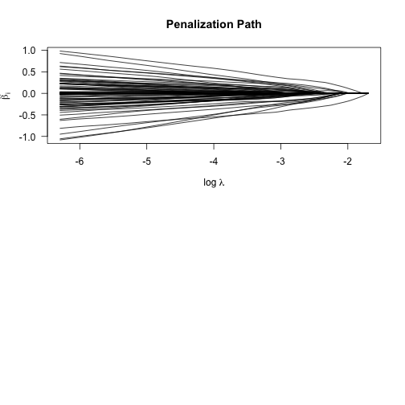
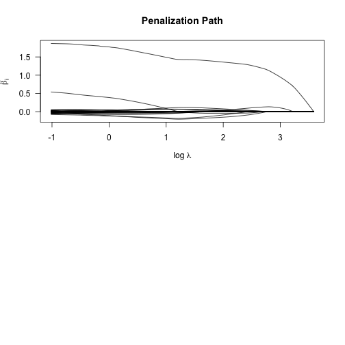
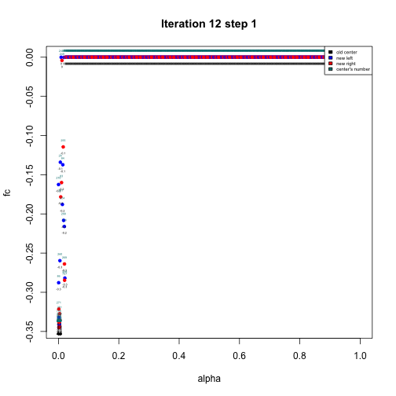

<!-- README.md is generated from README.Rmd. Please edit that file -->


# c060

# Extended Inference for Lasso and Elastic-Net Regularized Cox and Generalized Linear Models 

## Maintainer F. Bertrand

<https://doi.org/10.32614/CRAN.package.c060>

<!-- badges: start -->
[](https://doi.org/10.32614/CRAN.package.c060)
[](https://lifecycle.r-lib.org/articles/stages.html)
[](https://www.repostatus.org/#active)
[](https://github.com/fbertran/c060/actions)
[](https://app.codecov.io/gh/fbertran/c060?branch=master)
[](https://CRAN.R-project.org/package=c060)
[](https://cran.r-project.org/package=c060)
[](https://github.com/fbertran/c060)
<!-- badges: end -->

The goal of the `c060` package is to provide additional functions to perform stability selection, model validation and parameter tuning for glmnet models.

## Installation

You can install the released version of c060 from [CRAN](https://CRAN.R-project.org) with:


``` r
install.packages("c060")
```

And the development version from [GitHub](https://github.com/) with:


``` r
install.packages("devtools")
devtools::install_github("fbertran/c060")
```


# Examples

## Gaussian Stability Selection

``` r
set.seed(1234)
x=matrix(rnorm(100*1000,0,1),100,1000)
y <- x[1:100,1:1000] %*% c(rep(2,5),rep(-2,5),rep(.1,990))
res <- stabpath(y,x,weakness=1,mc.cores=2)
stabsel(res,error=0.05,type="pfer")
#> $stable
#> integer(0)
#> 
#> $lambda
#> [1] 2.02235
#> 
#> $lpos
#> [1] 8
#> 
#> $error
#> [1] 0.05
#> 
#> $type
#> [1] "pfer"
```

## Gaussian Stability Paths

``` r
set.seed(1234)
x <- matrix(rnorm(100*1000,0,1),100,1000)
y <- x[1:100,1:1000] %*% c(rep(2,5),rep(-2,5),rep(.1,990))
res <- stabpath(y,x,weakness=1,mc.cores=2)
plot(res)
#> Error in t.default(x$x): argument is not a matrix
```

<div class="figure">

<p class="caption">plot of chunk unnamed-chunk-5</p>
</div>

## Binomial Stability Paths

``` r
y=sample(1:2,100,replace=TRUE)
res <- stabpath(y,x,weakness=1,mc.cores=2,family="binomial")
plot(res)
#> Error in t.default(x$x): argument is not a matrix
```

<div class="figure">

<p class="caption">plot of chunk unnamed-chunk-6</p>
</div>


## Multinomial Stability Paths

``` r
y=sample(1:4,100,replace=TRUE)
res <- stabpath(y,x,weakness=1,mc.cores=2,family="multinomial")
#> Warning in mclapply(1:steps, mc.cores = mc.cores, glmnet.subset, subsets, :
#> all scheduled cores encountered errors in user code
#> Error in res[[1]]: subscript out of bounds
plot(res)
#> Error in t.default(x$x): argument is not a matrix
```

<div class="figure">

<p class="caption">plot of chunk unnamed-chunk-7</p>
</div>


## Poisson Stability Paths

``` r
N=100; p=1000
nzc=5
x=matrix(rnorm(N*p),N,p)
beta=rnorm(nzc)
f = x[,seq(nzc)] %*% beta
mu=exp(f)
y=rpois(N,mu)
res <- stabpath(y,x,weakness=1,mc.cores=2,family="poisson")
plot(res)
#> Error in t.default(x$x): argument is not a matrix
```

<div class="figure">

<p class="caption">plot of chunk unnamed-chunk-8</p>
</div>

## Cox Stability Paths

``` r
library(survival)
set.seed(10101)
N=100;p=1000
nzc=p/3
x=matrix(rnorm(N*p),N,p)
beta=rnorm(nzc)
fx=x[,seq(nzc)] %*% beta/3
hx=exp(fx)
ty=rexp(N,hx)
tcens=rbinom(n=N,prob=.3,size=1)
y=cbind(time=ty,status=1-tcens)
res <- stabpath(y,x,weakness=1,mc.cores=2,family="cox")
plot(res)
#> Error in t.default(x$x): argument is not a matrix
```

<div class="figure">

<p class="caption">plot of chunk unnamed-chunk-9</p>
</div>


## Example from glmnet package

``` r
set.seed(10101)
library(glmnet)
library(survival)
library(peperr)
```


``` r
N=1000;p=30
nzc=p/3
x=matrix(rnorm(N*p),N,p)
beta=rnorm(nzc)
fx=x[,seq(nzc)] %*% beta/3
hx=exp(fx)
ty=rexp(N,hx)
tcens=rbinom(n=N,prob=.3,size=1)# censoring indicator
y=Surv(ty,1-tcens)
```


# EPSGO


``` r
set.seed(1010)
n=1000;p=100
nzc=trunc(p/10)
x=matrix(rnorm(n*p),n,p)
beta=rnorm(nzc)
fx= x[,seq(nzc)] %*% beta
eps=rnorm(n)*5
y=drop(fx+eps)
px=exp(fx)
px=px/(1+px)
ly=rbinom(n=length(px),prob=px,size=1)
set.seed(1011)
```


## y - binomial

``` r
y.classes<-ifelse(y>= median(y),1, 0)
set.seed(1234)
nfolds = 10
foldid <- balancedFolds(class.column.factor=y.classes, cross.outer=nfolds)
#> 121 
#> 2 
#> 3 
#> 4 
#> 5 
#> 6 
#> 7 
#> 8 
#> 9 
#> 10
bounds <- t(data.frame(alpha=c(0, 1)))
colnames(bounds)<-c("lower","upper")
 
fit <- EPSGO(Q.func="tune.glmnet.interval", 
             bounds=bounds, 
             parms.coding="none", 
             seed = 1234, 
             show="final",
             fminlower = -100,
             x = x, y = y.classes, family = "binomial", 
             foldid = foldid,
             my.mfrow = c(4, 4),
             type.min = "lambda.1se",
             type.measure = "mse",
             verbose = FALSE)
#> ...done
#> ...done
#> ...done
#> ...done
#> ...done
#> [1] "finished? FALSE"
#> [1] "X"
#>        alpha
#> [1,] 0.04184
#>     Xtrain    Ytrain
#> 1  0.73445 0.4427822
#> 2  0.85311 0.4422716
#> 3  0.53235 0.4419218
#> 4  0.13097 0.4444470
#> 5  0.60814 0.4435479
#> 6  0.62236 0.4434463
#> 7  0.99216 0.4438921
#> 8  0.26607 0.4440248
#> 9  0.31969 0.4426631
#> 10 0.15851 0.4444240
#> 11 0.67349 0.4431161
#> 12 0.86540 0.4422268
#> 13 0.41169 0.4432506
#> 14 0.90698 0.4420846
#> 15 0.01183 0.4534574
#> 16 0.48959 0.4423172
#> 17 0.22937 0.4430704
#> 18 0.35578 0.4419665
#> 19 0.09411 0.4462451
#> 20 0.45474 0.4426950
#> 21 0.77450 0.4425921
#> ...done
#> ...done
#> ...done
#> ...done
#> ...done
#> [1] "finished? FALSE"
#> [1] "X"
#>      alpha
#> [1,]     0
#>      alpha    Ytrain
#> 1  0.73445 0.4427822
#> 2  0.85311 0.4422716
#> 3  0.53235 0.4419218
#> 4  0.13097 0.4444470
#> 5  0.60814 0.4435479
#> 6  0.62236 0.4434463
#> 7  0.99216 0.4438921
#> 8  0.26607 0.4440248
#> 9  0.31969 0.4426631
#> 10 0.15851 0.4444240
#> 11 0.67349 0.4431161
#> 12 0.86540 0.4422268
#> 13 0.41169 0.4432506
#> 14 0.90698 0.4420846
#> 15 0.01183 0.4534574
#> 16 0.48959 0.4423172
#> 17 0.22937 0.4430704
#> 18 0.35578 0.4419665
#> 19 0.09411 0.4462451
#> 20 0.45474 0.4426950
#> 21 0.77450 0.4425921
#> 22 0.04184 0.4502101
#> ...done
#> ...done
#> ...done
#> ...done
#> ...done
#> [1] "finished? FALSE"
#> [1] "X"
#>        alpha
#> [1,] 0.01859
#>      alpha    Ytrain
#> 1  0.73445 0.4427822
#> 2  0.85311 0.4422716
#> 3  0.53235 0.4419218
#> 4  0.13097 0.4444470
#> 5  0.60814 0.4435479
#> 6  0.62236 0.4434463
#> 7  0.99216 0.4438921
#> 8  0.26607 0.4440248
#> 9  0.31969 0.4426631
#> 10 0.15851 0.4444240
#> 11 0.67349 0.4431161
#> 12 0.86540 0.4422268
#> 13 0.41169 0.4432506
#> 14 0.90698 0.4420846
#> 15 0.01183 0.4534574
#> 16 0.48959 0.4423172
#> 17 0.22937 0.4430704
#> 18 0.35578 0.4419665
#> 19 0.09411 0.4462451
#> 20 0.45474 0.4426950
#> 21 0.77450 0.4425921
#> 22 0.04184 0.4502101
#> 23 0.00000 0.4563529
#> ...done
#> ...done
#> ...done
#> ...done
#> ...done
#> [1] "finished? FALSE"
#> [1] "X"
#>        alpha
#> [1,] 0.03437
#>      alpha    Ytrain
#> 1  0.73445 0.4427822
#> 2  0.85311 0.4422716
#> 3  0.53235 0.4419218
#> 4  0.13097 0.4444470
#> 5  0.60814 0.4435479
#> 6  0.62236 0.4434463
#> 7  0.99216 0.4438921
#> 8  0.26607 0.4440248
#> 9  0.31969 0.4426631
#> 10 0.15851 0.4444240
#> 11 0.67349 0.4431161
#> 12 0.86540 0.4422268
#> 13 0.41169 0.4432506
#> 14 0.90698 0.4420846
#> 15 0.01183 0.4534574
#> 16 0.48959 0.4423172
#> 17 0.22937 0.4430704
#> 18 0.35578 0.4419665
#> 19 0.09411 0.4462451
#> 20 0.45474 0.4426950
#> 21 0.77450 0.4425921
#> 22 0.04184 0.4502101
#> 23 0.00000 0.4563529
#> 24 0.01859 0.4535900
#> ...done
#> ...done
#> ...done
#> ...done
#> ...done
#> [1] "finished? FALSE"
#> [1] "X"
#>        alpha
#> [1,] 0.02538
#>      alpha    Ytrain
#> 1  0.73445 0.4427822
#> 2  0.85311 0.4422716
#> 3  0.53235 0.4419218
#> 4  0.13097 0.4444470
#> 5  0.60814 0.4435479
#> 6  0.62236 0.4434463
#> 7  0.99216 0.4438921
#> 8  0.26607 0.4440248
#> 9  0.31969 0.4426631
#> 10 0.15851 0.4444240
#> 11 0.67349 0.4431161
#> 12 0.86540 0.4422268
#> 13 0.41169 0.4432506
#> 14 0.90698 0.4420846
#> 15 0.01183 0.4534574
#> 16 0.48959 0.4423172
#> 17 0.22937 0.4430704
#> 18 0.35578 0.4419665
#> 19 0.09411 0.4462451
#> 20 0.45474 0.4426950
#> 21 0.77450 0.4425921
#> 22 0.04184 0.4502101
#> 23 0.00000 0.4563529
#> 24 0.01859 0.4535900
#> 25 0.03437 0.4498726
#> ...done
#> ...done
#> ...done
#> ...done
#> ...done
#> [1] "finished? FALSE"
#> [1] "X"
#>        alpha
#> [1,] 0.00565
#>      alpha    Ytrain
#> 1  0.73445 0.4427822
#> 2  0.85311 0.4422716
#> 3  0.53235 0.4419218
#> 4  0.13097 0.4444470
#> 5  0.60814 0.4435479
#> 6  0.62236 0.4434463
#> 7  0.99216 0.4438921
#> 8  0.26607 0.4440248
#> 9  0.31969 0.4426631
#> 10 0.15851 0.4444240
#> 11 0.67349 0.4431161
#> 12 0.86540 0.4422268
#> 13 0.41169 0.4432506
#> 14 0.90698 0.4420846
#> 15 0.01183 0.4534574
#> 16 0.48959 0.4423172
#> 17 0.22937 0.4430704
#> 18 0.35578 0.4419665
#> 19 0.09411 0.4462451
#> 20 0.45474 0.4426950
#> 21 0.77450 0.4425921
#> 22 0.04184 0.4502101
#> 23 0.00000 0.4563529
#> 24 0.01859 0.4535900
#> 25 0.03437 0.4498726
#> 26 0.02538 0.4515460
#> ...done
#> ...done
#> ...done
#> ...done
#> ...done
#> [1] "finished? FALSE"
#> [1] "X"
#>        alpha
#> [1,] 0.02255
#>      alpha    Ytrain
#> 1  0.73445 0.4427822
#> 2  0.85311 0.4422716
#> 3  0.53235 0.4419218
#> 4  0.13097 0.4444470
#> 5  0.60814 0.4435479
#> 6  0.62236 0.4434463
#> 7  0.99216 0.4438921
#> 8  0.26607 0.4440248
#> 9  0.31969 0.4426631
#> 10 0.15851 0.4444240
#> 11 0.67349 0.4431161
#> 12 0.86540 0.4422268
#> 13 0.41169 0.4432506
#> 14 0.90698 0.4420846
#> 15 0.01183 0.4534574
#> 16 0.48959 0.4423172
#> 17 0.22937 0.4430704
#> 18 0.35578 0.4419665
#> 19 0.09411 0.4462451
#> 20 0.45474 0.4426950
#> 21 0.77450 0.4425921
#> 22 0.04184 0.4502101
#> 23 0.00000 0.4563529
#> 24 0.01859 0.4535900
#> 25 0.03437 0.4498726
#> 26 0.02538 0.4515460
#> 27 0.00565 0.4550679
#> ...done
#> ...done
#> ...done
#> ...done
#> ...done
#> [1] "finished? FALSE"
#> [1] "X"
#>        alpha
#> [1,] 0.00881
#>      alpha    Ytrain
#> 1  0.73445 0.4427822
#> 2  0.85311 0.4422716
#> 3  0.53235 0.4419218
#> 4  0.13097 0.4444470
#> 5  0.60814 0.4435479
#> 6  0.62236 0.4434463
#> 7  0.99216 0.4438921
#> 8  0.26607 0.4440248
#> 9  0.31969 0.4426631
#> 10 0.15851 0.4444240
#> 11 0.67349 0.4431161
#> 12 0.86540 0.4422268
#> 13 0.41169 0.4432506
#> 14 0.90698 0.4420846
#> 15 0.01183 0.4534574
#> 16 0.48959 0.4423172
#> 17 0.22937 0.4430704
#> 18 0.35578 0.4419665
#> 19 0.09411 0.4462451
#> 20 0.45474 0.4426950
#> 21 0.77450 0.4425921
#> 22 0.04184 0.4502101
#> 23 0.00000 0.4563529
#> 24 0.01859 0.4535900
#> 25 0.03437 0.4498726
#> 26 0.02538 0.4515460
#> 27 0.00565 0.4550679
#> 28 0.02255 0.4518852
#> ...done
#> ...done
#> ...done
#> ...done
#> ...done
#> [1] "finished? FALSE"
#> [1] "X"
#>        alpha
#> [1,] 0.01515
#>      alpha    Ytrain
#> 1  0.73445 0.4427822
#> 2  0.85311 0.4422716
#> 3  0.53235 0.4419218
#> 4  0.13097 0.4444470
#> 5  0.60814 0.4435479
#> 6  0.62236 0.4434463
#> 7  0.99216 0.4438921
#> 8  0.26607 0.4440248
#> 9  0.31969 0.4426631
#> 10 0.15851 0.4444240
#> 11 0.67349 0.4431161
#> 12 0.86540 0.4422268
#> 13 0.41169 0.4432506
#> 14 0.90698 0.4420846
#> 15 0.01183 0.4534574
#> 16 0.48959 0.4423172
#> 17 0.22937 0.4430704
#> 18 0.35578 0.4419665
#> 19 0.09411 0.4462451
#> 20 0.45474 0.4426950
#> 21 0.77450 0.4425921
#> 22 0.04184 0.4502101
#> 23 0.00000 0.4563529
#> 24 0.01859 0.4535900
#> 25 0.03437 0.4498726
#> 26 0.02538 0.4515460
#> 27 0.00565 0.4550679
#> 28 0.02255 0.4518852
#> 29 0.00881 0.4553102
#> ...done
#> ...done
#> ...done
#> ...done
#> ...done
```

<div class="figure">

<p class="caption">plot of chunk unnamed-chunk-13</p>
</div>

```
#> [1] "finished? FALSE"
#> [1] "X"
#>        alpha
#> [1,] 0.00258
#>      alpha    Ytrain
#> 1  0.73445 0.4427822
#> 2  0.85311 0.4422716
#> 3  0.53235 0.4419218
#> 4  0.13097 0.4444470
#> 5  0.60814 0.4435479
#> 6  0.62236 0.4434463
#> 7  0.99216 0.4438921
#> 8  0.26607 0.4440248
#> 9  0.31969 0.4426631
#> 10 0.15851 0.4444240
#> 11 0.67349 0.4431161
#> 12 0.86540 0.4422268
#> 13 0.41169 0.4432506
#> 14 0.90698 0.4420846
#> 15 0.01183 0.4534574
#> 16 0.48959 0.4423172
#> 17 0.22937 0.4430704
#> 18 0.35578 0.4419665
#> 19 0.09411 0.4462451
#> 20 0.45474 0.4426950
#> 21 0.77450 0.4425921
#> 22 0.04184 0.4502101
#> 23 0.00000 0.4563529
#> 24 0.01859 0.4535900
#> 25 0.03437 0.4498726
#> 26 0.02538 0.4515460
#> 27 0.00565 0.4550679
#> 28 0.02255 0.4518852
#> 29 0.00881 0.4553102
#> 30 0.01515 0.4539218
#> [1] "No changes in the last 10 iterations, break iterations"
summary(fit)
#>             Length Class      Mode     
#> fmin         1     -none-     numeric  
#> xmin         1     -none-     numeric  
#> iter         1     -none-     numeric  
#> neval        1     -none-     numeric  
#> maxevals     1     -none-     numeric  
#> seed         1     -none-     numeric  
#> bounds       2     -none-     numeric  
#> Q.func       1     -none-     character
#> points.fmin  2     data.frame list     
#> Xtrain      31     -none-     numeric  
#> Ytrain      31     -none-     numeric  
#> gp.seed     10     -none-     numeric  
#> model.list  31     -none-     list
```


## y - multinomial: low - low 25%, middle - (25,75)-quantiles, high - larger 75%.

``` r
y.classes<-ifelse(y <= quantile(y,0.25),1, ifelse(y >= quantile(y,0.75),3, 2))
set.seed(1234)
nfolds = 10
foldid <- balancedFolds(class.column.factor=y.classes, cross.outer=nfolds)
#> 1231 
#> 2 
#> 3 
#> 4 
#> 5 
#> 6 
#> 7 
#> 8 
#> 9 
#> 10
bounds <- t(data.frame(alpha=c(0, 1)))
colnames(bounds)<-c("lower","upper")
 
fit <- EPSGO(Q.func="tune.glmnet.interval", 
             bounds=bounds, 
             parms.coding="none", 
             seed = 1234, 
             show="none",
             fminlower = -100,
             x = x, y = y.classes, family = "multinomial", 
             foldid = foldid,
             type.min = "lambda.1se",
             type.measure = "mse",
             verbose = FALSE)
#> ...done
#> ...done
#> ...done
#> ...done
#> ...done
#> [1] "finished? FALSE"
#> [1] "X"
#>       alpha
#> [1,] 0.0605
#>     Xtrain    Ytrain
#> 1  0.73445 0.5889776
#> 2  0.85311 0.5884918
#> 3  0.53235 0.5902795
#> 4  0.13097 0.5943578
#> 5  0.60814 0.5896935
#> 6  0.62236 0.5895989
#> 7  0.99216 0.5880701
#> 8  0.26607 0.5919904
#> 9  0.31969 0.5906950
#> 10 0.15851 0.5943488
#> 11 0.67349 0.5892911
#> 12 0.86540 0.5884489
#> 13 0.41169 0.5891854
#> 14 0.90698 0.5883127
#> 15 0.01183 0.6058205
#> 16 0.48959 0.5883259
#> 17 0.22937 0.5911021
#> 18 0.35578 0.5900189
#> 19 0.09411 0.5962309
#> 20 0.45474 0.5886749
#> 21 0.77450 0.5887978
#> ...done
#> ...done
#> ...done
#> ...done
#> ...done
#> [1] "finished? FALSE"
#> [1] "X"
#>        alpha
#> [1,] 0.03825
#>      alpha    Ytrain
#> 1  0.73445 0.5889776
#> 2  0.85311 0.5884918
#> 3  0.53235 0.5902795
#> 4  0.13097 0.5943578
#> 5  0.60814 0.5896935
#> 6  0.62236 0.5895989
#> 7  0.99216 0.5880701
#> 8  0.26607 0.5919904
#> 9  0.31969 0.5906950
#> 10 0.15851 0.5943488
#> 11 0.67349 0.5892911
#> 12 0.86540 0.5884489
#> 13 0.41169 0.5891854
#> 14 0.90698 0.5883127
#> 15 0.01183 0.6058205
#> 16 0.48959 0.5883259
#> 17 0.22937 0.5911021
#> 18 0.35578 0.5900189
#> 19 0.09411 0.5962309
#> 20 0.45474 0.5886749
#> 21 0.77450 0.5887978
#> 22 0.06050 0.5985227
#> ...done
#> ...done
#> ...done
#> ...done
#> ...done
#> [1] "finished? FALSE"
#> [1] "X"
#>        alpha
#> [1,] 0.07476
#>      alpha    Ytrain
#> 1  0.73445 0.5889776
#> 2  0.85311 0.5884918
#> 3  0.53235 0.5902795
#> 4  0.13097 0.5943578
#> 5  0.60814 0.5896935
#> 6  0.62236 0.5895989
#> 7  0.99216 0.5880701
#> 8  0.26607 0.5919904
#> 9  0.31969 0.5906950
#> 10 0.15851 0.5943488
#> 11 0.67349 0.5892911
#> 12 0.86540 0.5884489
#> 13 0.41169 0.5891854
#> 14 0.90698 0.5883127
#> 15 0.01183 0.6058205
#> 16 0.48959 0.5883259
#> 17 0.22937 0.5911021
#> 18 0.35578 0.5900189
#> 19 0.09411 0.5962309
#> 20 0.45474 0.5886749
#> 21 0.77450 0.5887978
#> 22 0.06050 0.5985227
#> 23 0.03825 0.5998758
#> ...done
#> ...done
#> ...done
#> ...done
#> ...done
#> [1] "finished? FALSE"
#> [1] "X"
#>      alpha
#> [1,]     0
#>      alpha    Ytrain
#> 1  0.73445 0.5889776
#> 2  0.85311 0.5884918
#> 3  0.53235 0.5902795
#> 4  0.13097 0.5943578
#> 5  0.60814 0.5896935
#> 6  0.62236 0.5895989
#> 7  0.99216 0.5880701
#> 8  0.26607 0.5919904
#> 9  0.31969 0.5906950
#> 10 0.15851 0.5943488
#> 11 0.67349 0.5892911
#> 12 0.86540 0.5884489
#> 13 0.41169 0.5891854
#> 14 0.90698 0.5883127
#> 15 0.01183 0.6058205
#> 16 0.48959 0.5883259
#> 17 0.22937 0.5911021
#> 18 0.35578 0.5900189
#> 19 0.09411 0.5962309
#> 20 0.45474 0.5886749
#> 21 0.77450 0.5887978
#> 22 0.06050 0.5985227
#> 23 0.03825 0.5998758
#> 24 0.07476 0.5974274
#> ...done
#> ...done
#> ...done
#> ...done
#> ...done
#> [1] "finished? FALSE"
#> [1] "X"
#>        alpha
#> [1,] 0.02692
#>      alpha    Ytrain
#> 1  0.73445 0.5889776
#> 2  0.85311 0.5884918
#> 3  0.53235 0.5902795
#> 4  0.13097 0.5943578
#> 5  0.60814 0.5896935
#> 6  0.62236 0.5895989
#> 7  0.99216 0.5880701
#> 8  0.26607 0.5919904
#> 9  0.31969 0.5906950
#> 10 0.15851 0.5943488
#> 11 0.67349 0.5892911
#> 12 0.86540 0.5884489
#> 13 0.41169 0.5891854
#> 14 0.90698 0.5883127
#> 15 0.01183 0.6058205
#> 16 0.48959 0.5883259
#> 17 0.22937 0.5911021
#> 18 0.35578 0.5900189
#> 19 0.09411 0.5962309
#> 20 0.45474 0.5886749
#> 21 0.77450 0.5887978
#> 22 0.06050 0.5985227
#> 23 0.03825 0.5998758
#> 24 0.07476 0.5974274
#> 25 0.00000 0.6118007
#> ...done
#> ...done
#> ...done
#> ...done
#> ...done
#> [1] "the differences in functions between 2 last iterations is small, stop iterations"
#> [1] "finished? TRUE"
#> [1] "X"
#>        alpha
#> [1,] 0.02692
#>      alpha    Ytrain
#> 1  0.73445 0.5889776
#> 2  0.85311 0.5884918
#> 3  0.53235 0.5902795
#> 4  0.13097 0.5943578
#> 5  0.60814 0.5896935
#> 6  0.62236 0.5895989
#> 7  0.99216 0.5880701
#> 8  0.26607 0.5919904
#> 9  0.31969 0.5906950
#> 10 0.15851 0.5943488
#> 11 0.67349 0.5892911
#> 12 0.86540 0.5884489
#> 13 0.41169 0.5891854
#> 14 0.90698 0.5883127
#> 15 0.01183 0.6058205
#> 16 0.48959 0.5883259
#> 17 0.22937 0.5911021
#> 18 0.35578 0.5900189
#> 19 0.09411 0.5962309
#> 20 0.45474 0.5886749
#> 21 0.77450 0.5887978
#> 22 0.06050 0.5985227
#> 23 0.03825 0.5998758
#> 24 0.07476 0.5974274
#> 25 0.00000 0.6118007
#> 26 0.02692 0.6012652
summary(fit)
#>             Length Class      Mode     
#> fmin         1     -none-     numeric  
#> xmin         1     -none-     numeric  
#> iter         1     -none-     numeric  
#> neval        1     -none-     numeric  
#> maxevals     1     -none-     numeric  
#> seed         1     -none-     numeric  
#> bounds       2     -none-     numeric  
#> Q.func       1     -none-     character
#> points.fmin  2     data.frame list     
#> Xtrain      26     -none-     numeric  
#> Ytrain      26     -none-     numeric  
#> gp.seed      6     -none-     numeric  
#> model.list  26     -none-     list
```

## Gaussian

``` r
set.seed(1234)
x=matrix(rnorm(100*1000,0,1),100,1000)
y <- x[1:100,1:1000]%*%c(rep(2,5),rep(-2,5),rep(.1,990))

foldid <- rep(1:10,each=10)

fit <- EPSGO(Q.func="tune.glmnet.interval", 
             bounds=bounds, 
             parms.coding="none", 
             seed = 1234, 
             show="none",
             fminlower = -100,
             x = x, y = y, family = "gaussian", 
             foldid = foldid,
             type.min = "lambda.1se",
             type.measure = "mse",
             verbose = FALSE)
#> ...done
#> ...done
#> ...done
#> ...done
#> ...done
#> [1] "finished? FALSE"
#> [1] "X"
#>      alpha
#> [1,]     1
#>     Xtrain   Ytrain
#> 1  0.73445 25.59440
#> 2  0.85311 25.34047
#> 3  0.53235 26.20553
#> 4  0.13097 32.02254
#> 5  0.60814 25.93154
#> 6  0.62236 25.88775
#> 7  0.99216 25.10230
#> 8  0.26607 29.01779
#> 9  0.31969 28.01304
#> 10 0.15851 31.00683
#> 11 0.67349 25.74568
#> 12 0.86540 25.31520
#> 13 0.41169 26.83464
#> 14 0.90698 25.23994
#> 15 0.01183 38.56498
#> 16 0.48959 26.40450
#> 17 0.22937 29.94172
#> 18 0.35578 27.74582
#> 19 0.09411 32.97585
#> 20 0.45474 26.58546
#> 21 0.77450 25.49951
#> ...done
#> ...done
#> ...done
#> ...done
#> ...done
#> [1] "finished? FALSE"
#> [1] "X"
#>        alpha
#> [1,] 0.97776
#>      alpha   Ytrain
#> 1  0.73445 25.59440
#> 2  0.85311 25.34047
#> 3  0.53235 26.20553
#> 4  0.13097 32.02254
#> 5  0.60814 25.93154
#> 6  0.62236 25.88775
#> 7  0.99216 25.10230
#> 8  0.26607 29.01779
#> 9  0.31969 28.01304
#> 10 0.15851 31.00683
#> 11 0.67349 25.74568
#> 12 0.86540 25.31520
#> 13 0.41169 26.83464
#> 14 0.90698 25.23994
#> 15 0.01183 38.56498
#> 16 0.48959 26.40450
#> 17 0.22937 29.94172
#> 18 0.35578 27.74582
#> 19 0.09411 32.97585
#> 20 0.45474 26.58546
#> 21 0.77450 25.49951
#> 22 1.00000 25.09094
#> ...done
#> ...done
#> ...done
#> ...done
#> ...done
#> [1] "finished? FALSE"
#> [1] "X"
#>        alpha
#> [1,] 0.95773
#>      alpha   Ytrain
#> 1  0.73445 25.59440
#> 2  0.85311 25.34047
#> 3  0.53235 26.20553
#> 4  0.13097 32.02254
#> 5  0.60814 25.93154
#> 6  0.62236 25.88775
#> 7  0.99216 25.10230
#> 8  0.26607 29.01779
#> 9  0.31969 28.01304
#> 10 0.15851 31.00683
#> 11 0.67349 25.74568
#> 12 0.86540 25.31520
#> 13 0.41169 26.83464
#> 14 0.90698 25.23994
#> 15 0.01183 38.56498
#> 16 0.48959 26.40450
#> 17 0.22937 29.94172
#> 18 0.35578 27.74582
#> 19 0.09411 32.97585
#> 20 0.45474 26.58546
#> 21 0.77450 25.49951
#> 22 1.00000 25.09094
#> 23 0.97776 25.12374
#> ...done
#> ...done
#> ...done
#> ...done
#> ...done
#> [1] "finished? FALSE"
#> [1] "X"
#>        alpha
#> [1,] 0.98756
#>      alpha   Ytrain
#> 1  0.73445 25.59440
#> 2  0.85311 25.34047
#> 3  0.53235 26.20553
#> 4  0.13097 32.02254
#> 5  0.60814 25.93154
#> 6  0.62236 25.88775
#> 7  0.99216 25.10230
#> 8  0.26607 29.01779
#> 9  0.31969 28.01304
#> 10 0.15851 31.00683
#> 11 0.67349 25.74568
#> 12 0.86540 25.31520
#> 13 0.41169 26.83464
#> 14 0.90698 25.23994
#> 15 0.01183 38.56498
#> 16 0.48959 26.40450
#> 17 0.22937 29.94172
#> 18 0.35578 27.74582
#> 19 0.09411 32.97585
#> 20 0.45474 26.58546
#> 21 0.77450 25.49951
#> 22 1.00000 25.09094
#> 23 0.97776 25.12374
#> 24 0.95773 25.15577
#> ...done
#> ...done
#> ...done
#> ...done
#> ...done
#> [1] "finished? FALSE"
#> [1] "X"
#>        alpha
#> [1,] 0.80954
#>      alpha   Ytrain
#> 1  0.73445 25.59440
#> 2  0.85311 25.34047
#> 3  0.53235 26.20553
#> 4  0.13097 32.02254
#> 5  0.60814 25.93154
#> 6  0.62236 25.88775
#> 7  0.99216 25.10230
#> 8  0.26607 29.01779
#> 9  0.31969 28.01304
#> 10 0.15851 31.00683
#> 11 0.67349 25.74568
#> 12 0.86540 25.31520
#> 13 0.41169 26.83464
#> 14 0.90698 25.23994
#> 15 0.01183 38.56498
#> 16 0.48959 26.40450
#> 17 0.22937 29.94172
#> 18 0.35578 27.74582
#> 19 0.09411 32.97585
#> 20 0.45474 26.58546
#> 21 0.77450 25.49951
#> 22 1.00000 25.09094
#> 23 0.97776 25.12374
#> 24 0.95773 25.15577
#> 25 0.98756 25.10930
#> ...done
#> ...done
#> ...done
#> ...done
#> ...done
#> [1] "the differences in functions between 2 last iterations is small, stop iterations"
#> [1] "finished? TRUE"
#> [1] "X"
#>        alpha
#> [1,] 0.80954
#>      alpha   Ytrain
#> 1  0.73445 25.59440
#> 2  0.85311 25.34047
#> 3  0.53235 26.20553
#> 4  0.13097 32.02254
#> 5  0.60814 25.93154
#> 6  0.62236 25.88775
#> 7  0.99216 25.10230
#> 8  0.26607 29.01779
#> 9  0.31969 28.01304
#> 10 0.15851 31.00683
#> 11 0.67349 25.74568
#> 12 0.86540 25.31520
#> 13 0.41169 26.83464
#> 14 0.90698 25.23994
#> 15 0.01183 38.56498
#> 16 0.48959 26.40450
#> 17 0.22937 29.94172
#> 18 0.35578 27.74582
#> 19 0.09411 32.97585
#> 20 0.45474 26.58546
#> 21 0.77450 25.49951
#> 22 1.00000 25.09094
#> 23 0.97776 25.12374
#> 24 0.95773 25.15577
#> 25 0.98756 25.10930
#> 26 0.80954 25.42666
summary(fit) 
#>             Length Class      Mode     
#> fmin         1     -none-     numeric  
#> xmin         1     -none-     numeric  
#> iter         1     -none-     numeric  
#> neval        1     -none-     numeric  
#> maxevals     1     -none-     numeric  
#> seed         1     -none-     numeric  
#> bounds       2     -none-     numeric  
#> Q.func       1     -none-     character
#> points.fmin  2     data.frame list     
#> Xtrain      26     -none-     numeric  
#> Ytrain      26     -none-     numeric  
#> gp.seed      6     -none-     numeric  
#> model.list  26     -none-     list
```

